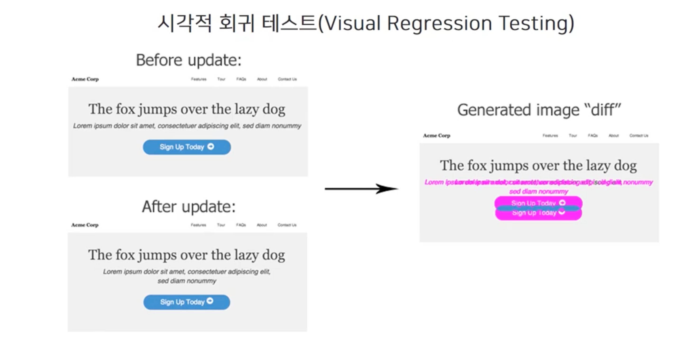

# 15장 실용적인 프론트엔드 테스트 전략

[9장 단위테스트](https://www.notion.so/9-6e971f210a204ad4b2887efbc142569e)에서 테스트에 대한 기본적인 개념과 테스트 원칙, 단위 테스트에 대해서 다뤄보았다. 다시 한번 테스트에 개념에 대해 짚어보자면, 테스트는 “**애플리케이션(의 함수, 특정 기능, UI, 성능, API 스펙)이 요구 사항에 맞게 동작하는지를 검증하는 행위**”라고 볼 수 있다. 보통은 개발의 결과물이 사용자에게 전달되기 직전에 QA(Quality Assuarnace)라는 과정을 거치는데, 이 과정을 테스트라고 보는 것이 일반적이다. 하지만 실제 전체 개발 과정을 살펴보면 이러한 검증이 각 단계에서 꾸준히 이루어진다.

이러한 상황에서 실제로 프로젝트에서 테스트를 적용하려고하면 아래와 같은 의문을 가질 수 있다.

- 내가 작성하는 테스트가 정말 나에게 도움을 주는걸까?
- 프론트엔드는 대체 무엇을 테스트 해야하지?

프론트엔드에서 테스트를 처음 한다면, 당연히 위와 같은 고민을 하게 될 것이다. 이번 장을 통해 이러한 고민을 해소할 수 있는 방법을 알아보자.

## 테스트를 하는 이유

> 무죄가 입증될 때까지 모든 코드는 유죄다.

**개발자의 필수 역량**이라고 하면 필요한 기능을 빠르게 구현하는 것이라고 먼저 말할 수 있다. 그러나 그 역량에 못지 않게 중요한 것이 **기능에 해당하는 테스트를 작성**하는 것이다. 테스트를 통해 내 코드를 입증할 수 있을 때, **자신감을 얻을 수 있으며, 내가 작성한 코드에 신뢰를 줄 수 있게 된다**.

이러한 테스트를 도와주는 테스트 도구를 잘 선택하고, 그것을 통해 **내가 의도한 기능대로 동작하는지 확인하며, 코드의 신뢰를 줄 수 있어야 한다**. 대표적인 테스트 도구로는 `Jest`, `Storybook`, `Cypress` 등이 있다.

## 어떤 것을 테스트할까?

테스트가 정말 중요하다는 것은 누구나 이제 알 수 있다. 그렇다면 모든 테스트에 대해 테스트를 작성해야할까? 아니다. **테스트 코드를 작성하고 유지 보수하는 데는 비용이 들기 때문이다**. 아래와 같은 상황은 더 중요한 곳에 투자할 수 잇는 소중한 비용을 낭비하는 것이라고 볼 수 있다.

- 테스트 커버리지를 억지로 100%로 맞추려고 한다.
- 중요한 로직이 거의 없는 단순한 코드까지도 모두 테스트를 하려고 한다.

기존에 작성되어 있는 테스트가 있더라도, 불필요하다면 제거하는 것이 낫다. 테스트 코드도 애플리케이션이 변화함에 따라 계속해서 관리를 해줘야 하기 때문이 **불필요한 테스트는 제거하면서 유지 보수 비용을 줄여나가는 것이 중요**하다.

## 테스트 자동화의 중요성

문제는 이러한 테스트가 대부분 반복적인 작업이라는 것이다. 이러한 반복된 작업을 매번 수동으로 진행하게 되면 꼭 필요한 테스트라도 부담스러워진다.애플리케이션이 복잡해질수록 테스트에 대한 비용이 점점 더 증가한다. 테스트 비용이 증가하면 테스트가 소홀해지고, 이는 애플리케이션의 품질 저하로 이어진다. 또, 코드를 수정할 때마다 매번 관련된 기능을 테스트해야 하는 부담 때문에 코드 개선을 망설이게 되고, 이는 코드의 품질 또한 저하시킨다.

그러므로 우리는 테스트를 자동화 해야한다. 자동화를 통해 아래와 같은 이점을 얻을 수 있기 때문이다.

- 자동화를 통해 **반복된 테스트 작업에 대한 비용이 줄어들게 된다**.
- **테스트가 누락되거나 잘못 검증하는 등의 실수도 방지**할 수 있다.
- 코드 수정에 대한 두려움이 없어져 **적극적으로 리팩토링** 등의 코드 개선을 통해 **코드 품질의 향상**으로 이어진다.

## 테스트가 어려운 이유

테스트는 기본적으로 입력값과 출력값을 검증하는 것이다. 백엔드는 일반적으로 HTTP(S) 요청 데이터로 입/출력값을 데이터로 검증이 가능하다. 그러나 **프론트엔드 코드는 사용자 환경과 밀접하게 연결되어 있고, 복잡한 시각적 요소를 다루기 때문에 테스트를 자동화하기가 어렵다.**

다르게 말하자면, 입력값은 데이터라기보다 사용자의 액션인 것들이 대부분이고, 출력값은 사실상 화면이 바뀌는 것이다. 그러므로 **입/출력을 데이터로써 코드로 검증하기가 쉽지 않다.**

### 입력 데이터

사실 입력 데이터는 브라우저 이벤트 시뮬레이션 API나 API를 mocking, E2E 테스트 도구를 사용하면 웬만한 입력들을 데이터화 할 수 있다.

- **DOM 이벤트**: 마우스, 키보드, 터치 등의 입력 이벤트
  → 브라우저의 이벤트 시뮬레이션 API 사용
- **라우팅/IO**: URL 변경, 네트워크/로컬 파일, 로컬 스토리지/쿠키
  → 생성: 브라우저 API 목킹, E2E 테스트 도구 사용

### 출력 데이터(시각적 요소)

**출력은 사실 시각적 데이터가 바뀌는 것이므로 검증하기가 쉽지 않다**. 이 시각적 요소인 출력값을 검증하기 위해 두가지 방식을 생각할 수 있다.

- 코드 관점: **HTML, CSS 코드의 내용 비교**를 통한 검증
- 사용자 관점: **브라우저가 렌더링한 화면을 캡쳐해서 이미지 비교**를 통한 검증(**픽셀 정보**)

위의 두 가지 방식으로 시각적 요소의 검증을 이뤄낼 수 있다. 하지만 이 두 가지는 각각 어느 정도의 문제를 가지고 있으며, 제대로된 검증이라고 하기 어렵다.

## 시각적 테스트 vs 기능적 테스트

프론트엔드 테스트에서의 핵심은 **시각적 테스트와 기능적 테스트, 이 두 가지 테스트 방식을 잘 구분하는 것이 굉장히 중요하다**.

| 분류              | 시각적 테스트                        | 기능적 테스트                   |
| ----------------- | ------------------------------------ | ------------------------------- |
| 용도              | 회귀 테스트                          | 모든 종류의 테스트              |
| TDD               | 불가능                               | 가능                            |
| 실행 환경         | 브라우저 외부(조작 가능 환경)        | 브라우저 내/외부, Node.js       |
| 테스트 도구       | 외부 서비스 필요 (유료)              | Jest, Mocah, Jasmind, Puppeteer |
| 결과 확인         | 이미지 확인을 위한 UI 필요           | 커맨드 라인에서 확인 가능       |
| CI 연동/이력 관리 | 이미지 확인/관리를 위한 별도 UI 필요 | 빌트인 기능으로 가능            |

시각적 테스트가 많은 단점을 가지고 있는 것에 반면, 기능적 테스트는 테스트도 빠르게 돌릴 수 있고, TDD도 가능한 것 등의 장점을 가지고 있는 것을 확인할 수 있다. 이러한 이유는 시각적인 부분을 코드로 검증하기 어렵기 때문인데, **어려운 시각적인 부분을 따로 준비된 환경에서 테스트하고, 나머지를 테스트하는 것이 효율적인 방식이**라고 볼 수 있다.

> 둘사이의 기준이 명확하지 않을 경우도 많기 때문에 프로젝트, 컴포넌트, 기능별 특징에 따라 적절한 방식을 선택하고, **테스트의 가치와 비용을 고려한 균형 있는 선택이 필요하다**

## 시각적 테스트

### HTML, 스냅샷 비교

가장 간단하게 시각적 요소를 검증할 수 있는 방법이다. HTML, CSS를 비교하는 것은 위와 같은 방법으로 이루어질 수 있다. 그러나 이 HTML 비교에는 다음과 같은 문제들이 있다. 아래 코드를 보고, 다음 질문에 대해 생각해보고 답해보자.

- **테스트가 나에게 신뢰를 주는가?**
- **HTML 구조를 보고 실제 결과물 (픽셀 정보)를 예측할 수 있는가?**
- **테스트가 성공하면 항상 의도된 결과가 나온다고 보장할 수 있는가?**
- **HTML/CSS를 리팩토링할 때 테스트가 도움을 주는가?**

```jsx
// 1. 문자열을 통한 시각적 요소의 검증 - diffableHTML 라이브러리 사용

test("생성시 버튼과 초기값을 렌더링한다.", () => {
  const div = document.createElement("div");
  ReactDOM.render(<Counter />, div);

  expect(diffableHTML(div.innerHTML)).toBe(
    diffableHTML(`
			<div class="simple-counter">
				<button class="dec">-<button>
				<span class="value">0</span>
				<button class="inc">+</button>
			</div>
		`)
  );
});
```

```jsx
// 2.  Jest의 스냅샷 테스트를 통한 시각적 요소의 검증

test("생성시 버튼과 초기값을 렌더링한다.", () => {
  const div = document.createElement("div");
  ReactDOM.render(<Counter />, div);

  expect(diffableHTML(div.innerHTML)).toMatchSnapshot();
});
```

맞다고 할 수 있는가? 아마 아닐 것이다. 우리는 작업할 때 항상 브라우저를 띄워두고 눈으로 확인해가며 작업을 해나간다. HTML구조나 CSS를 보고 의도한 대로 결과물이 나왔다고 생각하는 것은 불가능에 가깝다.

그 말은 결국 테스트가 성공했다고, 의도한 결과가 나왔다고 보장할 수 없다. 또, css의 기능은 같지만 클래스명만 바꿨다고 생각해보자. 그러나 테스트는 실패할 것이다. 화면에 보여질 것은 같지만, 구조가 다르기 때문이다. 그 말은 리팩토링 할 때도 도움을 주지 못하는 것이다. 그러므로 **위 방식은 신뢰를 주지 못한다**.

### 이미지 비교

우리가 테스트를 처음 배울 때, 다음과 같은 가이드라인을 접할 수 있다.

- 구현 상세(Implementation detail)에 대한 테스트를 지양하고, 동작(Behavior)를 테스트하라
- `private` 메서드에 대한 테스트를 지양하고, `public` 인터페이스를 테스트하라

구현 상세는 HTML, CSS에 해당하고, 동작은 이미지(픽셀 방식)에 해당할 것이다. 그렇다면 이미지의 픽셀 정보를 비교하는 방식으로 테스트를 해보자. 이러한 테스트 방식을 **시각적 회귀 테스트(Visual Regression Testing)** 라고 한다.



이러한 이미지 비교는 시각적 요소를 가장 확실하게 검증할 수 있는 방법이다. 그러나 이 방식도 문제를 가지는데 다음과 같다.

- **캡쳐 이미지의 신뢰성**
  - 픽실 단위의 비교로 이미지의 의미있는 변화를 찾기 어렵다.
  - 브라우저마다 렌더링되는 방식이 다르므로 이미지 픽셀이 다르게 인식되는 이슈
  - 이미지/폰트 로딩 시간, 커서, 애니메이션 등으로 인한 캡쳐 시점 차이
- **결과 확인 및 이력 관리의 어려움**
  - 커맨드 라인을 통한 확인이 불가능하므로 결과 확인을 위한 GUI가 필요하다.
  - 브라우저, 뷰포트 크기 등의 케이스별 이미지 파일 생성/관리가 필요하다.
  - 테스트 실행 단위별 이미지 파일 히스토리를 관리해야 한다.

그래도 위와 같은 문제들을 해결해줄 수 있는 `applitools`, `percy`, `chromatic`등과 같은 테스트 도구들이 있다. 캡쳐 이미지를 안정화해주거나 의미 있는 차이를 분석해서 화면에 표시해주거나 다양한 브라우저 및 뷰포트 사이즈별 이미지 생성 관리 등의 도움을 준다.

이러한 도구들을 쓰면 시각적 테스트를 할 수 있지만, 유료라는 단점이 있다. 효과에 비하면 가격은 감내할 수 있는 수준이라고 한다. 그러나 여전히 문제를 가지는데, 다음과 같다.

- **테스트 환경이 제한적이고 테스트 실행 속도가 느리다.**
- **테스트 의도가 코드에 명확하게 드러나지 않아 문서화가 불가능하고, TDD가 불가능하다.**
- **테스트 하나에서 너무 많은 것을 다루고 있어서 왜 테스트가 실패했는지 알 수 없다.**

## 기능적 테스트

**기능적 테스트에서 중요한 것은 시각적 요소의 의존성을 완벽하게 제거하는 것**이다. 값 확인을 위한 별도의 클래스를 할당하거나 테스트 아이디를 부여하여 테스트를 진행하는 등으로 하는 것이 좋다. 단순히 테스트의 이름이나 클래스의 변경으로 인해서 테스트가 최대한 깨지지 않도록 하고, 컴포넌트의 기능을 테스트하는 것에 집중이 되도록 해야한다.

### Bad:

```jsx
// 값이 제대로 나오는가?
test("초기값은 0이다", () => {
  const value = conatiner.querySelector(".value");

  expect(value.innerHTML).toBe("0");
});

// 버튼이 제대로 동작하는가?
test("+ 버튼 클릭 시 1 증가한다.", () => {
  const btnInc = container.querySelector("button.inc");
  const value = container.querySelector(".value");

  btnInc.click();

  expect(value.innerHTML).toBe("1");
});
```

이 경우 모종의 이유로 클래스명을 수정하게 된다면 테스트가 깨지게 된다.

### Good:

```jsx
// 값이 제대로 나오는가?
test("초기값은 0이다", () => {
  const value = screen.getByTestId("value");

  expect(value.textContent).toBe("0");
});

// 버튼이 제대로 동작하는가?
test("+ 버튼 클릭 시 1 증가한다.", () => {
  const btnInc = screen.getByRole("button", { name: "btn-inc" });
  const value = screen.getByTestId("value");

  btnInc.click();

  expect(value.textContent).toBe("1");
});
```

이제 시각적 정보의 변경으로 테스트가 깨지지 않게 된다.

## 스토리북: UI 개발 환경

스토리북은 사실 테스트 도구라기보다 **UI 개발 환경**이며, 공식 페이지에서도 그렇게 소개하고 있다. **컴포넌트들을 각각 독립적인 개발환경에서 개발할 수 있는 환경을 제공해주는 도구**에 가깝다. 일종의 컴포넌트 갤러리라고 할 수 있는데, 애플리케이션에서 사용되는 모든 컴포넌트의 조합을 페이지별로 등록해 놓고 편리하게 눈으로 확인할 수 있도록 네비게이션을 제공한다.

그렇다면 어떻게 시각적 테스트를 도와줄 수 있을까? 우리가 코드를 저장하고 결과를 확인하는 과정이 모두 사실 테스트이다. 그러나 컴포넌트의 모든 가능한 조합과 입력값이 미리 저장된 상태로 등록되어 있다면, 이러한 과정에서의 반복된 작업을 상당 부분 자동화할 수 있다.

그러므로 스토리북은 다음과 같다고 말할 수 있다.

- **시각적 요소 개발 환경**
  - 시각적 요소 개발을 위한 분리된 단위 테스트 환경
  - HTML/CSS 개발 단계에서 빠른 피드백 제공
- **시각적 테스트 자동화를 위한 보조 도구**
  - 검증이 필요한 다양한 시각적 케이스를 최소한의 코드로 관리
  - 수동으로 테스트할 때에도 많은 시간과 비용을 절약
  - 자동화 도구를 도입할 때 추가 비용없이 사용 가능

스토리북을 사용하는 방법에 대해서는 아래 페이지를 참고하자.

[UI 컴포넌트 구축하기](https://storybook.js.org/tutorials/design-systems-for-developers/react/ko/build/)

우리는 이전에 어떤 것을 테스트해야 하는가에 대해 고민한적이 있다. 스토리북에서의 테스트는 어떻게 해야할까?

### 단일 컴포넌트 스토리의 문제점

`props`가 없는 경우에는 간단하게 스토리를 작성할 수 있다. 그러나 `props`에 따라 상태가 변하는 컴포넌트는 **각 상태에 대한 스토리를 따로 등록해주는 것이 좋다**.

```tsx
import { ComponentMeta, ComponentStory } from '@storybook/react';
import TodoItem from './todo-item';

export default {
	title: 'todolist/todo-item',
	component: TodoItem
} as ComponentMeta<typeof TodoItem>

const Template: ComponentStory<typeof TodoItem> = ({id, text, completed, editing}) => {
	return <TodoItem id={id} text={text} completed={completed} editing={editing} />
};

export const Default = Template.bind({});
Default.args = {
	id: 1,
	text: 'Have a Breakfast",
	completed: false,
	editing: false,
}

export const Completed = Template.bind({});
Default.args = {
	id: 1,
	text: 'Have a Breakfast",
	completed: true,
	editing: false,
}

export const Editing = Template.bind({});
Default.args = {
	id: 1,
	text: 'Have a Breakfast",
	completed: false,
	editing: true,
}
```

일반적으로 컴포넌트라고 하면 ‘목록 아이템', ‘버튼', ‘입력 박스'와 같이 아주 작은 단위의 컴포넌트를 떠올리고, 스토리도 이러한 작은 단위에 대해 작성하게 된다. 하지만 실제 애플리케이션은 컴포넌트들의 조합에 의해 만들어지며, 여러 개의 컴포넌트가 조합된 복합 컴포넌트도 다수 존재한다.

이러한 복합 컴포넌트에 대한 스토리를 작성하지 않고, 단일 컴포넌트에 대해서만 스토리를 작성하는 것은, 마치 통합 테스트를 작성하지 않고 최소 단위의 단위 테스트만을 작성하는 것과 같다. 그러므로 다음과 같은 문제점을 가지게 된다.

- **실제 애플리케이션의 컴포넌트 조합을 검증할 수 없다.**
- **부모 컴포넌트의 내부 구현 변경 시 깨지기 쉽다.**

### 복합 컴포넌트 스토리의 문제점

반대로 아주 큰 단위의 컴포넌트를 사용해서 스토리를 작성하는 경우를 생각해보자. 컴포넌트의 수가 많고, 각각 여러가지 상태를 가진다고 생각해보자. 아마 모든 입력값을 제공하기 어렵고, 중복이 발생하게 될 것이다.

또, 컴포넌트 중 외부 환경에 반응해 `side effect`를 만들어내는 것들도 있을 것이다. 브라우저의 URL 변경에 따른 라우팅을 처리하거나, 컴포넌트가 마운트 될 때 API 서버에 요청을 보내서 데이터를 받아오는 등을 예로 들 수 있다. 컴포넌트 단위가 높아질수록 이러한 컴포넌트가 포함되어 있을 확률이 높을 것이고, 외부 환경에 대한 의존성을 제어할 방법이 필요해진다.

- 개별 컴포넌트의 모든 케이스를 검증하기 힘들다.
- 컴포넌트의 입력값을 제공하기가 어렵다.
- 외부 환경에 대한 의존성이 증가한다.

> **이처럼 양쪽 극단을 이용할 경우 각각의 장단점이 있다. 그러므로 애플리케이션의 성격에 맞게 적절한 크기로 스토리 단위로 나누는 것이 중요하다.**

## 단위 테스트 vs 통합 테스트

모든 컴포넌트(혹은 모듈)들의 단위 테스트가 필요하다고 생각할 수 있다. 애플리케이션에서 각각의 모든 컴포넌트들의 단위 테스트를 작성하고 모두 통과했다고 해보자. 애플리케이션이 이제 내가 원하는 대로 동작할까?

사실 이는 내가 원하는 기능을 동작하게 하기 위한 모든 기능을 테스트했다고 하기 어렵다. 각각의 컴포넌트들은 테스트했지만, 컴포넌트들의 연결이나 상태에 따른 각 컴포넌트들의 동작, 혹은 서버와의 연결 등은 테스트가 안되었다고 볼 수 있다. 단위 테스트를 모두 통과해도 실제로 애플리케이션을 동작시켰을 때, 아무 쓸모가 없을 수도 있다.

왜 대부분의 단위 테스트가 낭비인가에 대한 *James O Coplien*이 쓴 글이 있다. 이 글에서 말하고자 하는 내용은 다음과 같다.

- **테스트는 비용이다.**
  - 테스트 코드는 작성 및 유지보수, 컴퓨팅 시간/자원 등의 비용이 든다.
  - 불필요한 테스트를 최소화해야 한다.
- **단위 테스트는 필수가 아니다.**
  - 복잡하 로직이 없는(trivial) 코드의 단위 테스트는 **동어반복적(tautological)** 이다.
  - 단위 테스트는 지엽적인 검증이며, 사업적 가치를 갖지 않는 경우가 많다.
  - **시스템 테스트나 통합 테스트와 중복되는 단위 테스트는 제거하는 것이 좋다.**
  - 핵심 알고리즘을 갖는 모듈에 대한 단위 테스트는 여전히 중요하다.

### 통합 테스트는 어떻게 해야할까?

통합 테스트는 어떤 기준으로 해야하는지 의문이 들 수 있다. 테스트의 단위를 나누는 것은 개발자나 팀, 회사에 따라 다를 수 있기 때문이다. 일반적으로는 **실제로 하는 동작을 다 묶어서 테스트하는 것이 가장 효율적인 통합 테스트**라고한다.

> 단위 테스트와 통합 테스트는 각각의 장단점이 있다. **컴포넌트 단위의 통합 테스트를 우선적으로 고려**하고, 모듈 단위의 테스트, 애플리케이션 단위의 통합 테스트 등을 보조적으로 사용하자.

## Cypress

Cypress도 스토리북과 같이 정말 도움이되는 테스트 도구이다. E2E 테스트 도구지만 브라우저 내에서 돌아가서 굉장히 빠르며, 서버 목킹도 지원하기 때문에 프론트엔드 개발자가 통합 테스트를 하는 것을 도와주는 도구로 특화되었다고 볼 수 있다.

Cypress는 간편하게 테스트 코드를 작성할 수 있고, 각 이력에서 어떤 상태였는지 복기를 할 수 있다는 아주 큰 장점이 있어 디버깅이 굉장히 편하다. 즉, **개발 도구로도 사용할 수 있으며 TDD가 가능하다.**

- **브라우저 내부에서 실행**
  - 브라우저의 디버깅 도구(콘솔, 인스펙터 등) 사용 가능
  - 브라우저 익스텐션(리액트/리덕스 개발 도구 등) 사용 가능
  - UI 개발 환경: 커맨드 라인 환경보다 더 직관적
- **프론트엔드 개발을 위한 기능**
  - 손쉬운 서버 요청/응답 목킹
  - 실행된 모든 명령의 히스토리/스냅샷/데이터 확인 가능

## 요약

1. 내가 작성한 테스트가 **신뢰**를 주는지 항상 의심하자.
2. 테스트는 **비용**이다. 불필요한 테스트를 최소화하자.
3. **시각적 테스트와 기능적 테스트를 분리하자.**
4. 시각적 테스트를 자동화할 때는 전문 테스트 도구 사용을 고려하자.
5. 모듈 단위 테스트보다 **컴포넌트 단위의 통합 테스트**를 먼저 생각하자.
6. **Storybook**을 사용하면 시각적 요소를 편리하게 개발/테스트 할 수 있다.
7. **Cypress**를 사용하면 기능적 요소를 편리하게 개발/테스트 할 수 있다.
